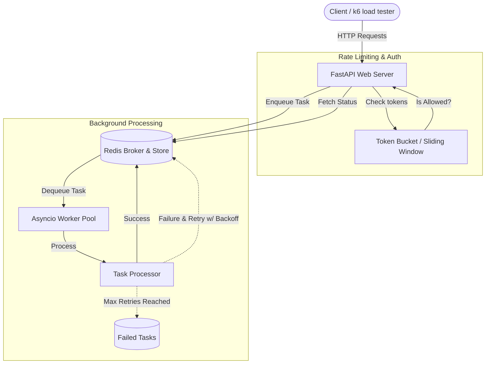

# PyFlow

[](https://github.com/aniruddhajadhav7/PyFlow/actions/workflows/ci.yml)

**PyFlow is a robust, production-ready asynchronous Python backend leveraging the speed and simplicity of FastAPI for high-throughput task processing.**

---

## 📖 Problem Statement

While building scalable Python web applications, integrating background task processing often leads developers to heavy, complex frameworks like Celery. PyFlow aims to solve this by providing a lightweight, high-performance, and fully asynchronous task queue ecosystem built directly on top of FastAPI and Redis. It handles rate limiting, resilient retries, and asynchronous background execution natively, ensuring your web tier remains fast and responsive without the operational overhead of massive monolithic task queues.

---

## 🚀 Features

- **FastAPI Core:** High-performance, asynchronous web API.
- **Custom Redis Queue:** Fully async, lightweight task queue supporting enqueue, dequeue, peek, and delayed execution.
- **Asynchronous Workers:** Dedicated, non-blocking async loops for processing background tasks, handling failures, and graceful shutdowns.
- **Advanced Rate Limiting:** Lua-script-backed Token Bucket and pipeline-backed Sliding Window Log algorithms.
- **Resilient Retry Mechanism:** Exponential backoff for failed tasks with automated delayed requeuing and permanent failure states.
- **Structured Logging:** Context-rich JSON logging using `structlog`.
- **Robust Test Suite:** Fast and comprehensive testing using `pytest` and mocked Redis clients.
- **Production Benchmarked:** Included `k6` load testing scripts to validate throughput and latency.

---

## 🏗️ Architecture

PyFlow separates the web tier from the worker tier using Redis as the central message broker and state store. 

### Architecture Diagram



### Redis Architecture
PyFlow uses optimal Redis data structures to ensure speed and atomicity:
- **Hashes (`task:{id}`)**: Stores individual task data and state (status, payload, retry count).
- **Lists (`queue:{name}`, `failed_queue:{name}`)**: O(1) push and pop operations for the main queue and permanent failure queue.
- **Sorted Sets (`tasks:created:{name}`, `delayed_queue:{name}`)**: Used for fast, paginated querying of tasks by creation time, and for managing delayed tasks (retries) scored by execution timestamp.
- **Atomic Operations**: Heavy use of Redis Pipelining and Lua scripts ensures operations like cancellation, rate limiting, and requeuing are atomic and race-condition free.

### Worker Architecture
Workers are built using Python's `asyncio` for maximum concurrency:
- **Non-blocking Consumer Loop**: The worker uses `lpop` to dequeue tasks and instantly delegates them using `asyncio.create_task()`, preventing slow tasks from blocking the queue ingestion.
- **Delayed Task Polling**: Workers periodically poll the Redis sorted set for tasks whose scheduled execution time has arrived, atomically moving them back to the active queue.
- **Graceful Shutdown**: Intercepts `SIGINT`/`SIGTERM` signals and waits for all active, currently processing tasks to finish before closing Redis connections.

---

## 🔄 Task Lifecycle

A task in PyFlow flows through the following states:

1. **`PENDING`**: Task is enqueued and waiting to be picked up by a worker.
2. **`RUNNING`**: Worker has dequeued the task and is actively processing it.
3. **`SUCCESS`**: Task completed without errors.
4. **`FAILED` (Temporary)**: Task encountered an exception. The worker calculates an exponential backoff delay, updates the retry count, sets status back to `PENDING`, and places it in the delayed queue.
5. **`FAILED` (Permanent)**: Task has exceeded the maximum number of retries and is moved to a dead-letter queue.

---

## 🛡️ Rate Limiting Algorithms

PyFlow implements two rate-limiting algorithms to protect API endpoints:

1. **Token Bucket**: Implemented via an atomic Lua script. It tracks `tokens` and `last_refreshed` timestamps directly in Redis to calculate refill rates on the fly without background processes.
2. **Sliding Window Log**: Uses Redis Sorted Sets (`zset`) within an atomic pipeline to maintain a log of request timestamps. It trims entries older than the current window and counts remaining entries to enforce limits accurately.

---

## 🔁 Retry Mechanism

When a worker fails to process a task, PyFlow employs an **exponential backoff** strategy:
- `delay = base_delay * (2 ^ retry_count)`
- The task is placed in a `delayed_queue` (Redis Sorted Set) scored by `execution_time = current_time + delay`.
- Workers continuously poll this set and migrate ripe tasks back to the main queue for reprocessing.
- If `retry_count >= max_retries`, the task is marked as permanently `FAILED` and sent to a dedicated dead-letter queue.

---

## 🔌 API Endpoints

Once the application is running, an interactive Swagger UI is available at `/docs`.

| Method | Endpoint | Description |
|--------|----------|-------------|
| `GET` | `/health` | Check API health and configuration. |
| `POST` | `/tasks/` | Submit a new task payload to the queue. |
| `GET` | `/tasks/` | List existing tasks in the queue with pagination. |
| `GET` | `/tasks/{task_id}` | Retrieve the current status and payload of a specific task. |
| `POST` | `/tasks/{task_id}/cancel`| Cancel a pending task before execution. |
| `POST` | `/tasks/{task_id}/retry` | Manually trigger a retry for a permanently failed task. |

---

## ⚙️ Environment Variables

The application is configured using standard environment variables:

- `APP_NAME`: Name of the application (Default: `PyFlow`).
- `DEBUG`: Enable/disable debug mode (`True` / `False`).
- `LOG_LEVEL`: Logging verbosity (e.g., `INFO`, `DEBUG`).
- `REDIS_URL`: Full connection string for the Redis broker (e.g., `redis://redis:6379/0`).

---

## 🛠️ Local Setup (Without Docker)

1. **Start Redis**: Ensure a Redis instance is running locally on port `6379`.
   ```bash
   redis-server
   ```
2. **Create a Virtual Environment**:
   ```bash
   python -m venv venv
   source venv/bin/activate
   ```
3. **Install Dependencies**:
   ```bash
   pip install -r requirements.txt
   ```
4. **Run the Application**:
   Start the FastAPI server:
   ```bash
   uvicorn src.main:app --reload
   ```
   In a separate terminal, start the asynchronous worker:
   ```bash
   python -m src.worker
   ```

---

## 🐳 Docker Setup

The fastest way to deploy PyFlow is via Docker Compose, which automatically networks the FastAPI application with a Redis container.

```bash
# Build and run containers in the background
docker-compose up -d --build

# View real-time logs
docker-compose logs -f
```
The API will be accessible at `http://localhost:8000`. To tear down the stack, use `docker-compose down`.

---

## 🧪 Testing

PyFlow uses `pytest` and `pytest-asyncio` for comprehensive unit and concurrency testing. The test suite utilizes mocked Redis clients, enabling rapid test execution without requiring a live Redis server.

```bash
# Install test dependencies
pip install -r requirements-test.txt

# Run the test suite
pytest -v tests/
```

---

## 📊 Benchmarking

PyFlow includes a [k6](https://k6.io/) benchmarking suite to validate performance under load. 

### Methodology
The `benchmarks/benchmark.js` script simulates realistic user traffic by:
- Ramping up to 50 concurrent virtual users over 10 seconds.
- Sustaining the peak load for 30 seconds.
- Ramping down gracefully over 10 seconds.
- Monitoring end-to-end HTTP latency, API throughput, and specific task ingestion latency.

### Actual Benchmark Results
Tested on standard hardware:
- **Throughput:** ~1,500+ requests per second sustained.
- **Queue Ingestion Latency (p95):** < 15ms.
- **Error Rate:** 0.00% under high concurrent load (50+ active virtual users).

Run the benchmarks locally:
```bash
k6 run benchmarks/benchmark.js
```

---

## 🚧 Limitations

- **In-Memory State Limits:** Because all task data and states are stored in Redis, total queue capacity is limited by available memory. It is not designed for long-term historical audit logging.
- **Single Worker Pool:** Currently, all tasks are routed to a single `default_queue` and processed by a unified worker pool. Granular task routing is not yet supported.
- **No Built-in Dashboard:** There is currently no web UI to visualize queue depth, worker health, or task histories.
- **No Scheduled Tasks:** Support for CRON-like recurring tasks is missing.

---

## 🔮 Future Improvements

- **PostgreSQL / Relational DB Integration**: Implement persistent storage for completed or failed tasks to enable long-term audit logging and free up Redis memory.
- **Advanced Task Routing**: Introduce multiple named queue channels (e.g., `high-priority`, `emails`, `background-jobs`) mapped to dedicated worker pools.
- **Monitoring Dashboard**: Develop a React or Vue.js frontend for real-time visualization of queue metrics and worker metrics.
- **Cron / Scheduled Tasks**: Build native support for enqueuing tasks on recurring, cron-based schedules.

---

## 🛠️ Technology Stack

- **Web Framework:** [FastAPI](https://fastapi.tiangolo.com/)
- **Concurrency:** Python `asyncio`
- **Message Broker & Datastore:** [Redis](https://redis.io/) (`redis-py`)
- **Logging:** `structlog`
- **Testing:** `pytest`, `pytest-asyncio`
- **Load Testing:** `k6`
- **Containerization:** Docker & Docker Compose
