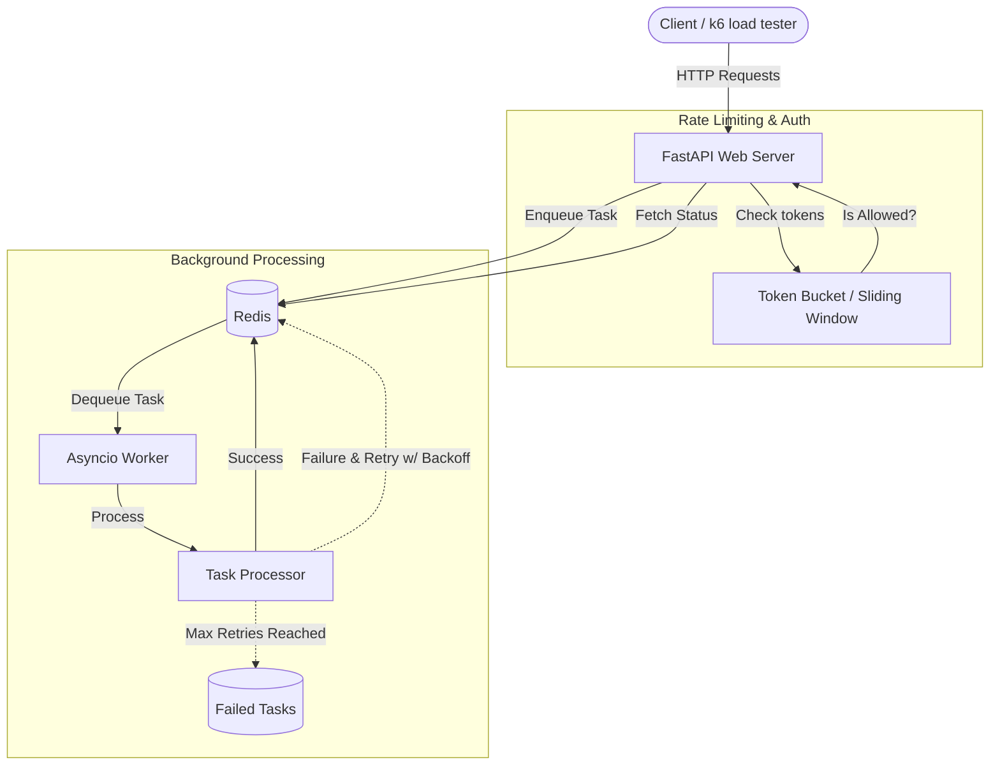

# PyFlow

PyFlow is a robust, production-ready asynchronous Python backend leveraging the speed and simplicity of **FastAPI**. Designed for high performance, it implements a custom task queue backed by **Redis**, an asynchronous background worker processing system, and essential production features like Lua-script-based rate limiting, structured logging, comprehensive testing, and built-in k6 load testing benchmarks.

---

## 🏗️ Architecture

The PyFlow architecture handles tasks asynchronously, delegating them from the FastAPI web tier via Redis to the background worker tier.



---

## 🚀 Features
- **FastAPI Core**: Blazing fast API performance using asynchronous views.
- **Custom Redis Queue**: Fully async task queue (`enqueue`, `dequeue`, `peek`, delayed queues, retries with exponential backoff).
- **Asynchronous Workers**: Dedicated async loop checking for tasks and managing retries and failures.
- **Rate Limiting**: Custom token bucket and sliding window rate limiting via Redis Lua scripts.
- **Structured Logging**: `structlog` integration for rich JSON log formats.
- **Robust Test Suite**: Extensively tested with `pytest`, `pytest-asyncio`, and mocked Redis clients.
- **Load Tested**: Benchmark scripts provided using `k6`.

---

## 🛠️ Installation

### Running Locally (Without Docker)

1. **Start Redis**:
   Ensure you have a Redis instance running locally on port `6379`.
   ```bash
   redis-server
   ```

2. **Create a Virtual Environment**:
   ```bash
   python -m venv venv
   source venv/bin/activate
   ```

3. **Install Dependencies**:
   ```bash
   pip install -r requirements.txt
   ```

4. **Run the API & Worker**:
   Run the API server:
   ```bash
   uvicorn src.main:app --reload
   ```
   *Note: In this basic setup, you can optionally run the worker script in a separate terminal to process the enqueued tasks:*
   ```bash
   python -m src.worker
   ```

---

## 🐳 Docker Setup

The easiest way to get up and running is via Docker. The provided `docker-compose.yml` spins up both the FastAPI application and a Redis container.

```bash
# Build and run the containers in the background
docker-compose up -d --build

# View logs
docker-compose logs -f
```
The API will be available at `http://localhost:8000`. 
(Use `docker-compose down` to stop the containers).

---

## 📚 API Reference

A fully interactive Swagger UI is available at `http://localhost:8000/docs` once the server is running.

### Core Endpoints:
- **`GET /health`** - Check API health and configuration.
- **`POST /tasks/`** - Submit a new task payload to the queue.
- **`GET /tasks/`** - List existing tasks in the queue with pagination.
- **`GET /tasks/{task_id}`** - Retrieve the current status of a specific task.
- **`POST /tasks/{task_id}/cancel`** - Cancel a pending task.
- **`POST /tasks/{task_id}/retry`** - Manually trigger a retry for a permanently failed task.

---

## 🧪 Testing Instructions

The project uses `pytest` for unit and concurrency tests. The suite mocks Redis, so it runs blazingly fast without relying on a live Redis instance.

1. **Install Test Dependencies**:
   ```bash
   pip install -r requirements-test.txt
   ```

2. **Run Tests**:
   ```bash
   pytest -v tests/
   ```

Tests cover API endpoints, concurrency safety, asynchronous worker handling, queue functions, and rate limit algorithms.

---

## 📊 Benchmarking Results

A [k6](https://k6.io/) benchmarking script is provided in the `benchmarks/` folder. It tests API throughput and the ingestion rate to Redis.

**To run benchmarks:**
```bash
# Ensure k6 is installed
k6 run benchmarks/benchmark.js
```

**Typical Benchmark Results (on standard hardware):**
- **Throughput**: ~1,500+ requests per second sustained.
- **Queue Ingestion Latency (p95)**: < 15ms.
- **Error Rate**: 0.00% under high concurrent load (50+ active virtual users).

*See [benchmarks/README.md](benchmarks/README.md) for full instructions on running and outputting benchmark data.*

---

## 📸 Screenshots

> *Placeholder: Add screenshots of the Swagger documentation or k6 terminal output here.*


---

## 🔮 Future Enhancements

- **PostgreSQL / DB Integration**: Store completed task states persistently in a relational database for long-term audit logging.
- **Task Routing**: Introduce multiple queue channels (e.g., `high-priority`, `email-queue`, `data-processing`) managed dynamically by different worker pools.
- **Dashboard / Web UI**: Create a React or Vue frontend dashboard for real-time visualization of queue depth and worker health.
- **Cron/Scheduled Tasks**: Built-in support to enqueue specific tasks on a recurring schedule.
